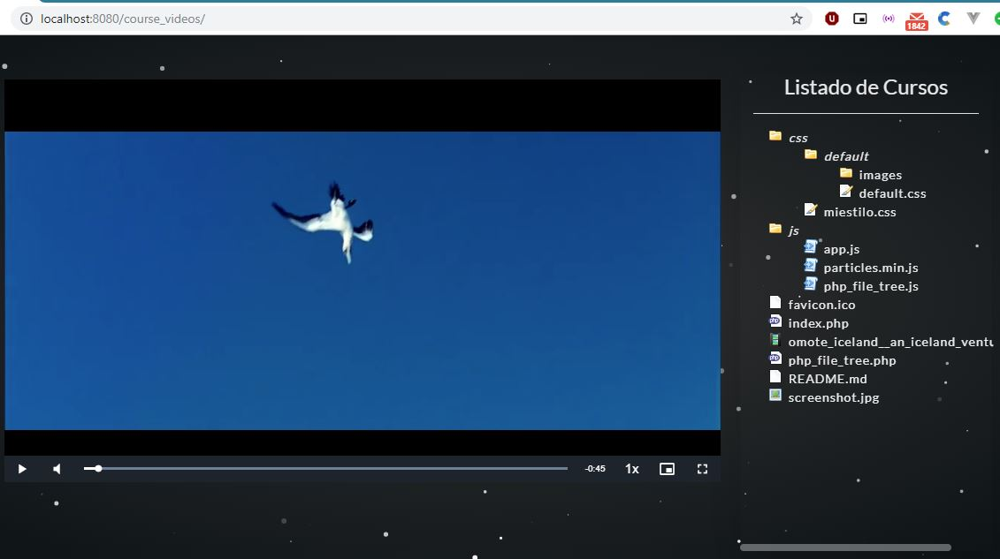

# Proyecto 01: Reproductor de videos web
Esta pagina web utiliza las funciones de php para listar los archivos de la carpeta raiz y al realizar clic sobre cualquier archivo trata de reproducirlo utilizando la libreria VideoJs

# Recursos utilizados

  * [Bootstrap_4]- Bootrstrap 4 (Css Grid)
  * [VideoJs] - Reproductor HTML5 personalizable
  * [Php_file_tree] - Listar archivos y directorios
  * [particlesJS] - Efecto particles

### Instalación
Utiliza tu servidor web favorito con php y copia la carpeta al directorio raiz

### Captura de pantalla

  [Bootstrap_4]: <https://getbootstrap.com/>
  [VideoJs]: <https://videojs.com/>
  [Php_file_tree]: <https://www.abeautifulsite.net/php-file-tree>
  [particlesJS]: <https://vincentgarreau.com/particles.js/>

